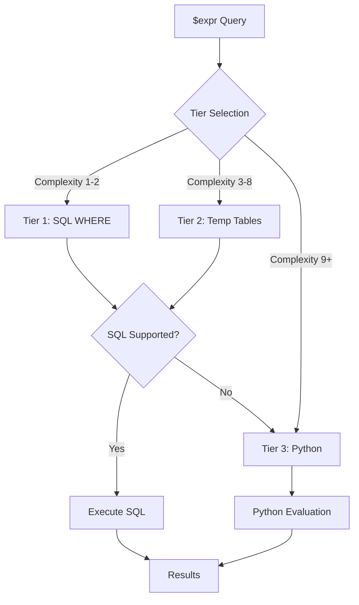

# NeoSQLite $expr Operator Implementation

## Overview

This document describes the implementation of the MongoDB `$expr` operator in NeoSQLite. The `$expr` operator allows the use of aggregation pipeline expressions within query predicates, enabling powerful field-to-field comparisons and complex conditional logic.

## Three-Tier Processing Architecture

NeoSQLite employs a sophisticated three-tier approach for `$expr` evaluation:

1. **Tier 1: Single SQL Query (Fastest)** - Uses SQLite JSON/JSONB functions for direct SQL evaluation
2. **Tier 2: Temporary Tables (Prototype)** - Pre-extracts fields into temporary tables for complex expressions (currently defaults to Python fallback)
3. **Tier 3: Python Fallback (Slowest but complete)** - Full Python evaluation for unsupported operations



### Tier Selection Logic

The tier is selected based on expression complexity scoring:

| Complexity Score | Tier | Description |
|-----------------|------|-------------|
| 1-2 | Tier 1 | Simple comparisons, basic operators |
| 3-8 | Tier 2 | Nested arithmetic, conditionals, multiple operations |
| 9+ | Tier 3 | Very complex expressions, unsupported operators |

Complexity is calculated by:
- Base expression: 1 point
- Each nested operator: +1 point
- Arithmetic operators: +1 point each
- Conditional operators: +2 points each
- Array operators: +2 points each

## Implemented Operators

### Comparison Operators (7/7 - 100%)

| Operator | Description | SQL Support | Python Support |
|----------|-------------|-------------|----------------|
| `$eq` | Equal to | ✅ | ✅ |
| `$ne` | Not equal to | ✅ | ✅ |
| `$gt` | Greater than | ✅ | ✅ |
| `$gte` | Greater than or equal | ✅ | ✅ |
| `$lt` | Less than | ✅ | ✅ |
| `$lte` | Less than or equal | ✅ | ✅ |
| `$cmp` | Compare two values | ✅ | ✅ |

**Example:**
```python
# Find documents where qty > reserved
collection.find({"$expr": {"$gt": ["$qty", "$reserved"]}})
```

### Logical Operators (4/4 - 100%)

| Operator | Description | SQL Support | Python Support |
|----------|-------------|-------------|----------------|
| `$and` | Logical AND | ✅ | ✅ |
| `$or` | Logical OR | ✅ | ✅ |
| `$not` | Logical NOT | ✅ | ✅ |
| `$nor` | Logical NOR | ✅ | ✅ |

**Example:**
```python
# Find documents where qty > 5 AND qty < 10
collection.find({
    "$expr": {
        "$and": [
            {"$gt": ["$qty", 5]},
            {"$lt": ["$qty", 10]}
        ]
    }
})
```

### Arithmetic Operators (12/19 - 63%)

| Operator | Description | SQL Support | Python Support |
|----------|-------------|-------------|----------------|
| `$add` | Addition | ✅ | ✅ |
| `$subtract` | Subtraction | ✅ | ✅ |
| `$multiply` | Multiplication | ✅ | ✅ |
| `$divide` | Division | ✅ | ✅ |
| `$mod` | Modulo | ✅ | ✅ |
| `$abs` | Absolute value | ✅ | ✅ |
| `$ceil` | Ceiling | ✅ | ✅ |
| `$floor` | Floor | ✅ | ✅ |
| `$round` | Round | ✅ | ✅ |
| `$trunc` | Truncate | ✅ | ✅ |
| `$pow` | Power | ✅ | ✅ |
| `$sqrt` | Square root | ✅ | ✅ |
| `$sum` | Sum of array | ❌ | ❌ |
| `$avg` | Average | ❌ | ❌ |
| `$min` | Minimum | ❌ | ❌ |
| `$max` | Maximum | ❌ | ❌ |
| `$log` | Logarithm | ❌ | ❌ |
| `$log10` | Base-10 log | ❌ | ❌ |
| `$exp` | Exponential | ❌ | ❌ |

**Example:**
```python
# Find documents where price * qty != total
collection.find({
    "$expr": {
        "$ne": [{"$multiply": ["$price", "$qty"]}, "$total"]
    }
})
```

### Conditional Operators (3/3 - 100%)

| Operator | Description | SQL Support | Python Support |
|----------|-------------|-------------|----------------|
| `$cond` | If-then-else | ✅ | ✅ |
| `$ifNull` | If null fallback | ✅ | ✅ |
| `$switch` | Multi-branch conditional | ❌ | ✅ |

**Example:**
```python
# Apply discount based on quantity
collection.find({
    "$expr": {
        "$lt": [
            {
                "$cond": {
                    "if": {"$gte": ["$qty", 10]},
                    "then": {"$multiply": ["$price", 0.5]},
                    "else": "$price"
                }
            },
            5
        ]
    }
})
```

### Array Operators (8/16 - 50%)

| Operator | Description | SQL Support | Python Support |
|----------|-------------|-------------|----------------|
| `$size` | Array size | ✅ | ✅ |
| `$in` | Element in array | ✅ | ✅ |
| `$isArray` | Check if array | ✅ | ✅ |
| `$arrayElemAt` | Get element at index | ❌ | ✅ |
| `$first` | First element | ❌ | ✅ |
| `$last` | Last element | ❌ | ✅ |
| `$slice` | Slice array | ❌ | ✅ |
| `$indexOfArray` | Find element index | ✅ | ✅ |
| `$filter` | Filter array | ❌ | ❌ |
| `$map` | Transform array | ❌ | ❌ |
| `$reduce` | Reduce array | ❌ | ❌ |
| `$concatArrays` | Concatenate arrays | ❌ | ❌ |
| `$reverseArray` | Reverse array | ❌ | ❌ |
| `$zip` | Zip arrays | ❌ | ❌ |
| `$arrayToObject` | Array to object | ❌ | ❌ |
| `$range` | Generate range | ❌ | ❌ |

**Example:**
```python
# Find documents where array size > 2
collection.find({
    "$expr": {"$gt": [{"$size": ["$items"]}, 2]}
})
```

### String Operators (12/19 - 63%)

| Operator | Description | SQL Support | Python Support |
|----------|-------------|-------------|----------------|
| `$concat` | Concatenate strings | ✅ | ✅ |
| `$toLower` | To lowercase | ✅ | ✅ |
| `$toUpper` | To uppercase | ✅ | ✅ |
| `$strLenBytes` | String length (bytes) | ✅ | ✅ |
| `$substr` | Substring | ✅ | ✅ |
| `$trim` | Trim whitespace | ✅ | ✅ |
| `$ltrim` | Trim left | ✅ | ✅ |
| `$rtrim` | Trim right | ✅ | ✅ |
| `$indexOfBytes` | Find substring | ✅ | ✅ |
| `$regexMatch` | Regex match | ✅ | ✅ |
| `$split` | Split string | ❌ | ✅ |
| `$replaceAll` | Replace all | ✅ | ✅ |
| `$strLenCP` | Length (code points) | ❌ | ❌ |
| `$substrCP` | Substring (code points) | ❌ | ❌ |
| `$indexOfCP` | Find (code points) | ❌ | ❌ |
| `$regexFind` | Find regex | ❌ | ❌ |
| `$regexFindAll` | Find all regex | ❌ | ❌ |
| `$replaceOne` | Replace one | ❌ | ❌ |

**Example:**
```python
# Find documents where lowercase name equals "john"
collection.find({
    "$expr": {"$eq": [{"$toLower": ["$name"]}, "john"]}
})
```

### Date/Time Operators (12/17 - 71%)

| Operator | Description | SQL Support | Python Support |
|----------|-------------|-------------|----------------|
| `$year` | Extract year | ✅ | ✅ |
| `$month` | Extract month | ✅ | ✅ |
| `$dayOfMonth` | Day of month | ✅ | ✅ |
| `$hour` | Extract hour | ✅ | ✅ |
| `$minute` | Extract minute | ✅ | ✅ |
| `$second` | Extract second | ✅ | ✅ |
| `$millisecond` | Extract millisecond | ✅ | ✅ |
| `$dayOfWeek` | Day of week | ✅ | ✅ |
| `$dayOfYear` | Day of year | ✅ | ✅ |
| `$week` | Week number | ✅ | ✅ |
| `$isoDayOfWeek` | ISO day of week | ✅ | ✅ |
| `$isoWeek` | ISO week | ✅ | ✅ |
| `$dateToString` | Format date | ❌ | ❌ |
| `$dateFromParts` | Create date | ❌ | ❌ |
| `$dateToParts` | Extract parts | ❌ | ❌ |
| `$toDate` | Convert to date | ❌ | ❌ |
| `$dateTrunc` | Truncate date | ❌ | ❌ |

**Example:**
```python
# Find documents from year 2024
collection.find({
    "$expr": {"$eq": [{"$year": ["$date"]}, 2024]}
})
```

### Object Operators (3/5 - 60%)

| Operator | Description | SQL Support | Python Support |
|----------|-------------|-------------|----------------|
| `$mergeObjects` | Merge objects | ✅ | ✅ |
| `$getField` | Get field value | ✅ | ✅ |
| `$setField` | Set field value | ✅ | ✅ |
| `$unsetField` | Remove field | ❌ | ❌ |
| `$objectToArray` | Object to array | ❌ | ❌ |

**Example:**
```python
# Merge two objects
collection.find({
    "$expr": {
        "$eq": [
            {"$mergeObjects": ["$obj1", "$obj2"]},
            {"field": "value"}
        ]
    }
})
```

### Type Conversion Operators (5/11 - 45%)

| Operator | Description | SQL Support | Python Support |
|----------|-------------|-------------|----------------|
| `$type` | Get BSON type | ❌ | ✅ |
| `$toString` | Convert to string | ❌ | ✅ |
| `$toInt` | Convert to int | ❌ | ✅ |
| `$toDouble` | Convert to double | ❌ | ✅ |
| `$toBool` | Convert to boolean | ❌ | ✅ |
| `$toLong` | Convert to long | ❌ | ❌ |
| `$toDecimal` | Convert to decimal | ❌ | ❌ |
| `$toObjectId` | Convert to ObjectId | ❌ | ❌ |
| `$convert` | General conversion | ❌ | ❌ |
| `$toBinData` | Convert to binary | ❌ | ❌ |
| `$toRegex` | Convert to regex | ❌ | ❌ |

**Example:**
```python
# Convert string to int for comparison
collection.find({
    "$expr": {"$eq": [{"$toInt": ["$strField"]}, 42]}
})
```

### Other Operators (1/2 - 50%)

| Operator | Description | SQL Support | Python Support |
|----------|-------------|-------------|----------------|
| `$literal` | Escape special chars | ❌ | ✅ |
| `$let` | Define variables | ❌ | ❌ |

## Missing Features Summary

**Total:** 36 operators missing out of ~103 total implementable MongoDB $expr operators (**65% coverage**)

*Note: This analysis focuses on operators implementable in NeoSQLite's 3-tier architecture (SQL, Temp Tables, Python). Excluded are server-specific features (e.g., $rand, $function, $meta), window functions ($denseRank, $rank, etc.), time series operators ($tsIncrement, $tsSecond), encryption features ($encStrContains, etc.), and other SQLite-irrelevant operators.*

| Category | Implemented | Missing | Coverage |
|----------|-------------|---------|----------|
| Comparison | 7 | **0** | 100% ✅ |
| Logical | 4 | **0** | 100% ✅ |
| Arithmetic | 12 | **7** | 63% |
| Conditional | 3 | **0** | 100% ✅ |
| Array | 8 | **8** | 50% |
| String | 12 | **7** | 63% |
| Date/Time | 12 | **5** | 71% |
| Object | 3 | **2** | 60% |
| Type Conversion | 5 | **6** | 45% |
| Other | 1 | **1** | 50% |

## Missing Features by Priority

### 🔴 High Priority (12 operators)

**Date Arithmetic (3):**
- `$dateAdd` - Add time to date
- `$dateSubtract` - Subtract time from date
- `$dateDiff` - Calculate difference between dates

**Advanced Aggregation (4):**
- `$sum` - Sum of array elements
- `$avg` - Average of array elements
- `$min` - Minimum of array elements
- `$max` - Maximum of array elements

**Array Transformation (3):**
- `$filter` - Filter array elements
- `$map` - Transform array elements
- `$reduce` - Reduce array to single value

**Regex Operations (2):**
- `$regexFind` - Find first regex match
- `$regexFindAll` - Find all regex matches

### 🟡 Medium Priority (18 operators)

**Set Operations (7):**
- `$setEquals` - Check set equality
- `$setIntersection` - Set intersection
- `$setUnion` - Set union
- `$setDifference` - Set difference
- `$setIsSubset` - Check subset
- `$anyElementTrue` - Any element true
- `$allElementsTrue` - All elements true

**Trigonometric (7):**
- `$sin`, `$cos`, `$tan` - Basic trig functions
- `$asin`, `$acos`, `$atan` - Inverse trig functions
- `$atan2` - Two-argument arctangent

**Angle Conversion (2):**
- `$degreesToRadians` - Convert degrees to radians
- `$radiansToDegrees` - Convert radians to degrees

**Object Manipulation (2):**
- `$unsetField` - Remove field from object
- `$objectToArray` - Convert object to key-value array

### 🟢 Low Priority (16 operators)

**Advanced Math (4):**
- `$log` - Natural logarithm
- `$log10` - Base-10 logarithm
- `$ln` - Natural log (alias)
- `$exp` - Exponential function

**Advanced String (4):**
- `$strLenCP` - String length (code points)
- `$substrCP` - Substring (code points)
- `$indexOfCP` - Find substring (code points)
- `$replaceOne` - Replace first occurrence

**Type Conversion (6):**
- `$toLong` - Convert to 64-bit integer
- `$toDecimal` - Convert to Decimal128
- `$toObjectId` - Convert to ObjectId
- `$convert` - General type conversion
- `$toBinData` - Convert to binary
- `$toRegex` - Convert to regex

**Variables (1):**
- `$let` - Define variables for expression

**Special (1):**
- `$switch` - Multi-branch conditional (complex expressions)

## Implementation Effort Estimate

| Priority | Operators | Estimated Effort | Complexity |
|----------|-----------|-----------------|------------|
| 🔴 High | 12 | 2-3 weeks | Medium-High |
| 🟡 Medium | 14 | 2-3 weeks | Medium |
| 🟢 Low | 10 | 1-2 weeks | Low-Medium |
| **Total** | **36** | **5-8 weeks** | - |

*Note: Effort estimates assume similar implementation patterns to existing operators. Actual time may vary based on SQLite limitations and testing requirements.*

## Original Missing Features Tables

### High Priority (Not Implemented)

| Category | Operators | Notes |
|----------|-----------|-------|
| **Date Arithmetic** | `$dateAdd`, `$dateSubtract`, `$dateDiff` | SQLite has limited date arithmetic |
| **Advanced Aggregation** | `$sum`, `$avg`, `$min`, `$max` (array) | Requires array processing |
| **Array Transformation** | `$filter`, `$map`, `$reduce` | Complex nested evaluation |
| **Regex Operations** | `$regexFind`, `$regexFindAll` | SQLite REGEXP limitations |

### Medium Priority (Not Implemented)

| Category | Operators | Notes |
|----------|-----------|-------|
| **Set Operations** | `$setEquals`, `$setIntersection`, `$setUnion`, `$setDifference`, `$setIsSubset`, `$anyElementTrue`, `$allElementsTrue` | 7 operators |
| **Trigonometric** | `$sin`, `$cos`, `$tan`, `$asin`, `$acos`, `$atan`, `$atan2` | 7 operators |
| **Angle Conversion** | `$degreesToRadians`, `$radiansToDegrees` | 2 operators |
| **Object Manipulation** | `$unsetField`, `$objectToArray` | 2 operators |

### Low Priority (Not Implemented)

| Category | Operators | Notes |
|----------|-----------|-------|
| **Advanced Math** | `$log`, `$log10`, `$ln`, `$exp` | 4 operators |
| **Advanced String** | `$strLenCP`, `$substrCP`, `$indexOfCP`, `$replaceOne` | 4 operators |
| **Type Conversion** | `$toLong`, `$toDecimal`, `$toObjectId`, `$convert`, `$toBinData`, `$toRegex` | 6 operators |
| **Variables** | `$let` | Variable scoping complexity |

## Usage Examples

### Basic Field Comparison

```python
# Find documents where field1 equals field2
collection.find({
    "$expr": {"$eq": ["$field1", "$field2"]}
})
```

### Complex Nested Expression

```python
# Find documents where (a + b) * 2 > c AND a != b
collection.find({
    "$expr": {
        "$and": [
            {"$gt": [{"$multiply": [{"$add": ["$a", "$b"]}, 2]}, "$c"]},
            {"$ne": ["$a", "$b"]}
        ]
    }
})
```

### Combined with Regular Query

```python
# Find documents where category == "A" AND qty > reserved
collection.find({
    "category": "A",
    "$expr": {"$gt": ["$qty", "$reserved"]}
})
```

### Using Date Operators

```python
# Find documents from 2024 where month is January
collection.find({
    "$expr": {
        "$and": [
            {"$eq": [{"$year": ["$date"]}, 2024]},
            {"$eq": [{"$month": ["$date"]}, 1]}
        ]
    }
})
```

## Kill Switch

The `$expr` implementation includes a kill switch for debugging and benchmarking:

```python
from neosqlite.collection.query_helper import set_force_fallback

# Force Python evaluation (Tier 3)
set_force_fallback(True)

# Normal operation (auto tier selection)
set_force_fallback(False)
```

See `FORCE_FALLBACK_KILL_SWITCH.md` for details.

## Testing

Tests are organized in `tests/test_expr/` by operator category:

```
tests/test_expr/
├── test_comparison_operators.py
├── test_logical_operators.py
├── test_arithmetic_math_operators.py
├── test_conditional_operators.py
├── test_date_operators.py
├── test_string_operators.py
├── test_array_operators.py
├── test_object_operators.py
├── test_type_operators.py
├── test_sql_python_consistency.py
├── test_error_handling.py
├── test_kill_switch.py
└── test_integration.py
```

Run tests:
```bash
pytest tests/test_expr/ -v
```

## Implementation Files

| File | Description | Lines |
|------|-------------|-------|
| `neosqlite/collection/expr_evaluator.py` | Tier 1 & Tier 3 evaluator | ~1300 |
| `neosqlite/collection/expr_temp_table.py` | Tier 2 temp table evaluator | ~550 |
| `neosqlite/collection/query_helper.py` | Tier selection logic | ~300 |

## Performance Considerations

1. **Tier 1 (SQL)**: Fastest - single query execution
2. **Tier 2 (Temp Tables)**: Intermediate - pre-extraction overhead
3. **Tier 3 (Python)**: Slowest - full document iteration

Use the kill switch to benchmark and compare performance between tiers.

## Future Enhancements

1. **Tier 2 Enhancement**: Implement full temporary table support for complex expressions (currently in prototype)
2. **Additional Operators**: Implement missing high-priority operators
3. **Type Conversion SQL**: Implement SQL-tier support for `$toString`, `$toInt`, etc.
4. **Index Optimization**: Leverage indexes for `$expr` queries where possible
4. **Query Planning**: Optimize tier selection based on data characteristics
