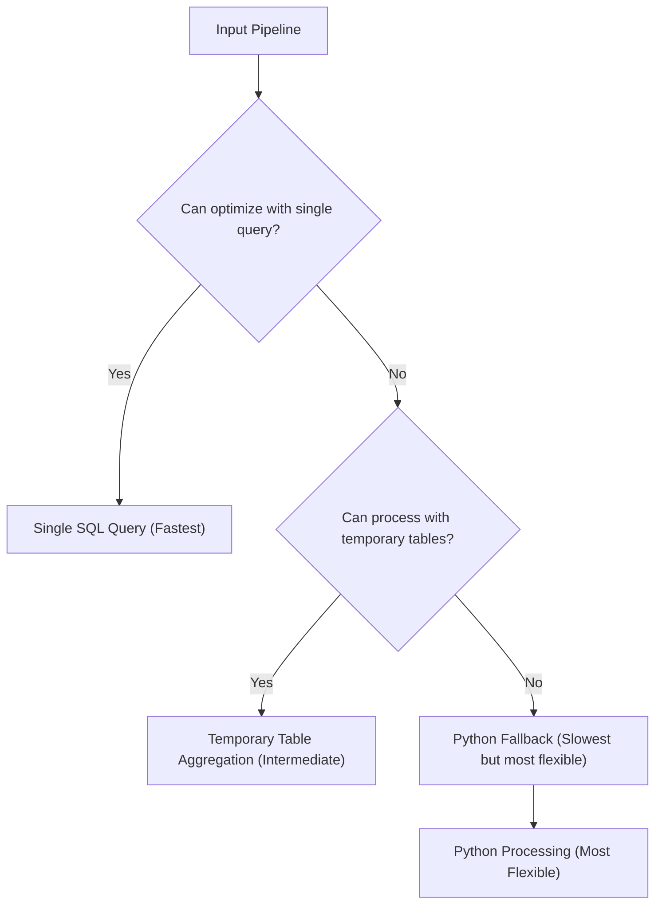

# Temporary Table Aggregation Pipeline Enhancement for NeoSQLite

## Overview

This document summarizes the implementation of a temporary table aggregation pipeline enhancement for NeoSQLite that addresses the limitations of the current all-or-nothing approach to pipeline optimization.

## Current Limitations

NeoSQLite currently employs a binary approach to aggregation pipeline optimization:

1. **SQL Optimization Path**: Attempt to process the entire pipeline with a single optimized SQL query
2. **Python Fallback Path**: If SQL optimization is not possible, fall back to Python-based processing for the entire pipeline

This approach has several limitations:
- Complex pipeline combinations cannot be expressed in a single SQL query
- Position constraints for optimized stages (e.g., `$lookup` must be last)
- Intermediate results consume Python memory instead of database storage
- Limited optimization opportunities for multi-stage pipelines

## Enhancement Approach

The temporary table aggregation enhancement introduces a third processing path that bridges the gap between pure SQL optimization and Python fallback:



## Enhancement Implementation

We've implemented a temporary table approach that:

1. **Processes pipeline stages incrementally** using temporary tables
2. **Stores intermediate results in temporary tables** rather than Python memory
3. **Executes compatible groups of stages** as SQL operations
4. **Automatically cleans up temporary tables** using transaction management

## Key Components

### 1. Context Manager
- Automatic resource management with guaranteed cleanup
- Transaction-based atomicity using SQLite SAVEPOINTs
- Deterministic temporary table creation with unique names based on pipeline structure

### 2. Pipeline Processor
- Support for `$match`, `$unwind`, `$sort`, `$skip`, `$limit`, `$lookup`, and `$addFields` stages
- Handling of consecutive `$unwind` stages
- Proper parameter handling and SQL injection prevention

### 3. Integration Function
- Tries multiple approaches in order of preference:
  1. Existing SQL optimization
  2. Temporary table processing
  3. Python fallback

## Supported Stages

The current implementation supports:
- ✅ `$match` - Filtering documents with various operators (`$eq`, `$gt`, `$lt`, `$in`, etc.)
- ✅ `$unwind` - Array decomposition, including multiple consecutive stages
- ✅ `$sort` - Sorting documents by fields
- ✅ `$skip` - Skipping documents
- ✅ `$limit` - Limiting results
- ✅ `$lookup` - Joining collections (in any position)
- ✅ `$addFields` - Adding new fields to documents

The `$group` stage is not supported by the temporary table implementation but is handled by the Python fallback.

## Benefits Achieved

### Performance Improvements
- **Reduced Memory Usage**: Intermediate results stored in database, not Python memory
- **Better Resource Management**: Automatic cleanup with guaranteed resource release
- **Scalability**: Ability to process larger datasets that might not fit in Python memory

### Flexibility
- **Granular Optimization**: Process individual stages or groups of stages
- **Position Independence**: Remove position constraints for optimized stages
- **Wider Coverage**: More pipeline combinations can benefit from SQL optimization

### Robustness
- **Atomic Operations**: Use SQLite transactions/SAVEPOINTs for atomicity
- **Error Handling**: Graceful fallback between approaches
- **Resource Cleanup**: Guaranteed cleanup of temporary resources

## Integration Strategy

The enhancement is integrated into NeoSQLite's `QueryEngine.aggregate_with_constraints` method via the `integrate_with_neosqlite` function:

```python
def integrate_with_neosqlite(
    query_engine, pipeline: List[Dict[str, Any]]
) -> List[Dict[str, Any]]:
    # First, try the existing SQL optimization approach
    try:
        query_result = query_engine.helpers._build_aggregation_query(pipeline)
        if query_result is not None:
            # Process with existing optimization
            return process_sql_results(query_result)
    except Exception:
        pass

    # Try the temporary table approach for supported pipelines
    if can_process_with_temporary_tables(pipeline):
        try:
            processor = TemporaryTableAggregationProcessor(
                query_engine.collection
            )
            return processor.process_pipeline(pipeline)
        except Exception:
            pass

    # Fall back to the existing Python implementation
    return process_with_python(pipeline)
```

## Future Enhancements

1. **Additional Stage Support**: Extend to support `$project` and other stages.
2. **Query Planning**: Intelligently decide which approach to use based on pipeline complexity
3. **Streaming Results**: Stream results from temporary tables to reduce memory usage
4. **Parallel Processing**: Process independent pipeline branches in parallel

## Conclusion

The temporary table aggregation pipeline enhancement provides a significant improvement over the current binary approach by:

- Expanding the range of pipelines that can be processed efficiently with SQL
- Providing better resource management through automatic cleanup
- Maintaining full backward compatibility
- Offering a path toward processing even more complex pipelines efficiently

This enhancement represents a practical step toward the long-term goal of handling 95% of common aggregation pipelines at the SQL level while maintaining the flexibility of Python fallback for complex cases.
