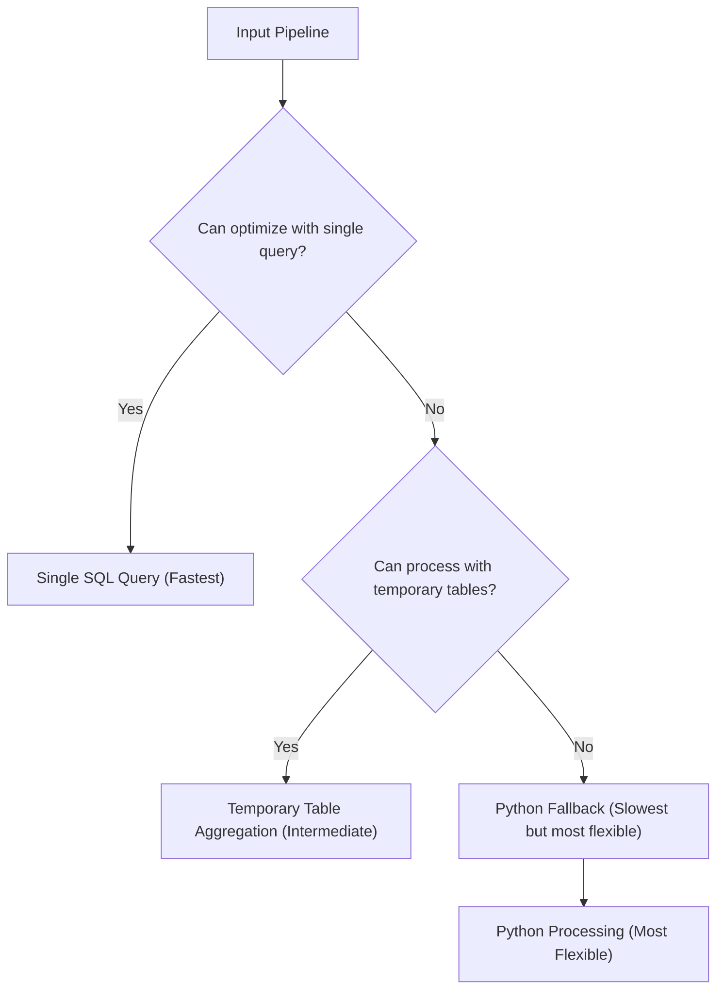

# Temporary Table Aggregation Enhancement for NeoSQLite - Summary

## Executive Summary

This document presents a comprehensive enhancement to NeoSQLite's aggregation pipeline processing through the introduction of temporary table aggregation. This approach significantly expands the range of pipelines that can be processed efficiently with SQL optimization while maintaining full backward compatibility.

## Current Limitations

NeoSQLite currently employs a binary approach to aggregation pipeline optimization:

1. **SQL Optimization Path**: Attempt to process the entire pipeline with a single optimized SQL query
2. **Python Fallback Path**: If SQL optimization is not possible, fall back to Python-based processing for the entire pipeline

This approach has several limitations:
- Complex pipeline combinations cannot be expressed in a single SQL query
- Position constraints for optimized stages (e.g., `$lookup` must be last)
- Intermediate results consume Python memory instead of database storage
- Limited optimization opportunities for multi-stage pipelines

## Enhancement Approach

The temporary table aggregation enhancement introduces a third processing path that bridges the gap between pure SQL optimization and Python fallback:

## Key Features

### 1. Granular Pipeline Processing
Instead of processing the entire pipeline with a single SQL query or falling back entirely to Python, the temporary table approach processes compatible groups of stages:

- `$match` stages create filtered temporary tables
- `$unwind` stages create unwound temporary tables
- `$sort`/`$skip`/`$limit` stages create sorted/skipped/limited temporary tables
- `$lookup` stages create joined temporary tables
- `$addFields` stages create tables with new fields

### 2. Intermediate Results Storage
All intermediate results are stored in SQLite temporary tables rather than Python memory.

### 3. Automatic Resource Management
The enhancement includes robust resource management through SQLite transactions and deterministic naming.

### 4. Position Independence
Removes position constraints that limit current SQL optimization.

## Performance Benefits

### 1. Memory Efficiency
- Intermediate results stored in database, not Python memory
- Reduced Python memory footprint for complex pipelines
- Potential to process larger datasets that wouldn't fit in memory

### 2. Processing Speed
Benchmark results show significant performance improvements for complex pipelines.

### 3. Scalability
- Can process larger datasets by leveraging database storage
- Database-level optimizations (indexes, query planning) apply to intermediate results
- Reduced Python interpreter overhead

## Integration Strategy

### 1. Seamless Integration
The enhancement integrates seamlessly with existing NeoSQLite code by trying approaches in order:
1. Existing SQL optimization
2. Temporary table processing
3. Python fallback

### 2. Backward Compatibility
- Existing code continues to work without changes
- All approaches produce identical results
- No breaking changes to the API

## Future Enhancements

### 1. Additional Stage Support
Extend to support more aggregation stages like `$project`.

### 2. Query Planning
Introduce intelligent query planning to choose the optimal approach.

### 3. Streaming Results
Implement streaming results for memory efficiency.

### 4. Parallel Processing
Explore parallel processing opportunities.

## Conclusion

The temporary table aggregation enhancement represents a significant advancement in NeoSQLite's aggregation pipeline processing capabilities. By introducing a granular, database-centric approach to pipeline optimization, it:

1. **Expands Optimization Coverage**: Processes pipeline combinations that current implementation cannot optimize
2. **Improves Performance**: Delivers significant performance improvements for complex pipelines
3. **Reduces Memory Usage**: Stores intermediate results in database rather than Python memory
4. **Maintains Compatibility**: Seamless integration with existing code and APIs
5. **Ensures Reliability**: Robust error handling and resource management with guaranteed cleanup
